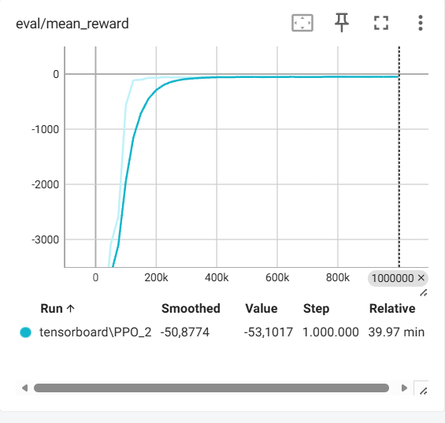
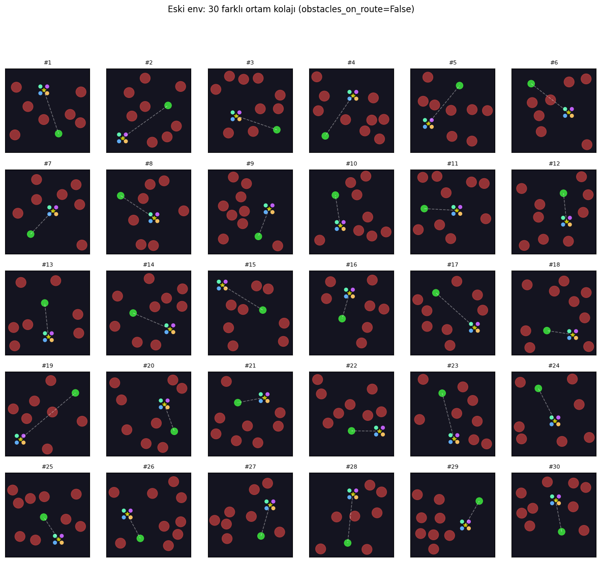
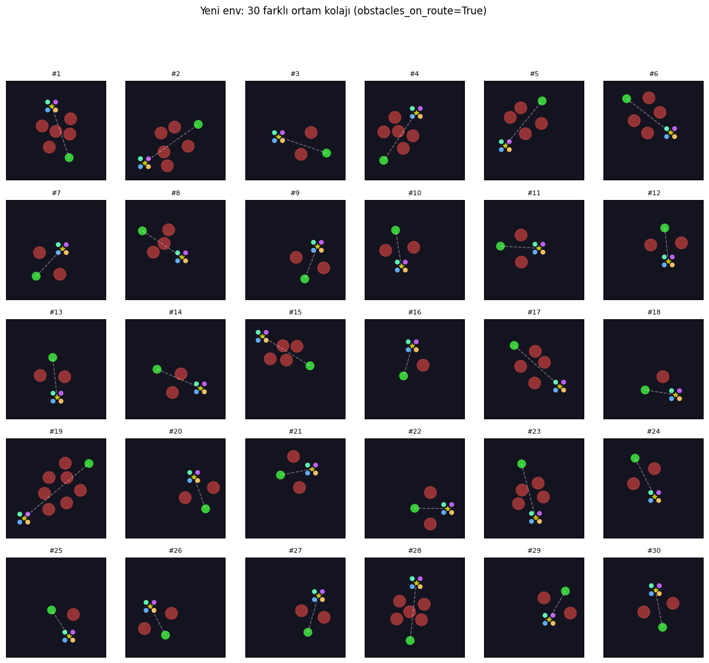
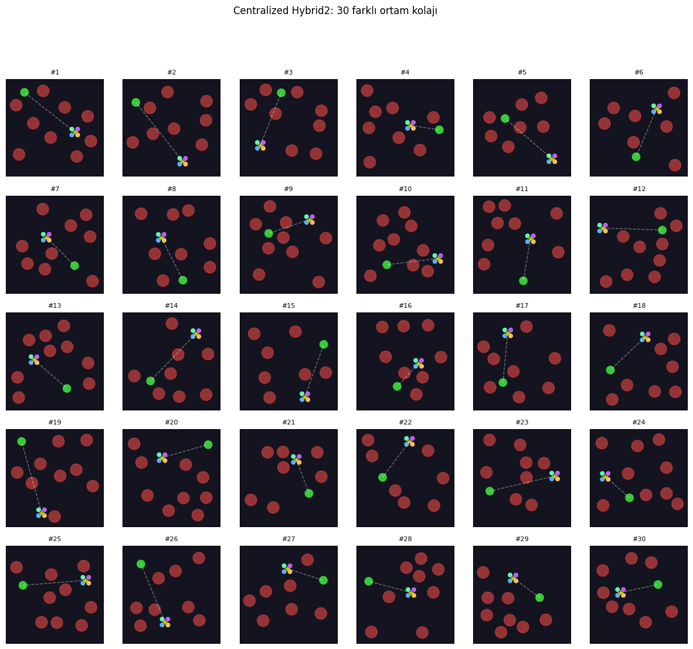
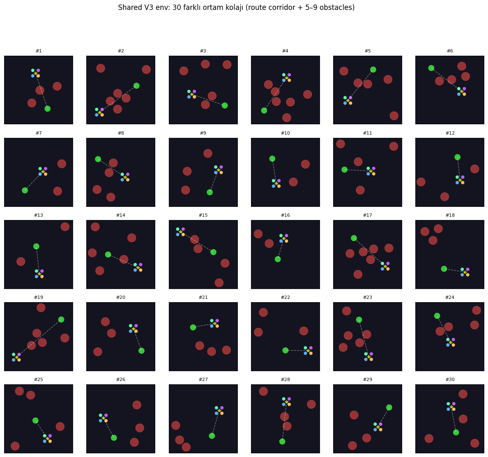

# TESTING.md — Test ve Doğrulama

Sistemin test senaryoları, sınırları ve sonuçları.

---

## Test Ortamları

### 1. Rastgele parkur (eğitim ortamı)

`visualize_pygame_v2.py` ve `evaluate.py` — her episode rastgele başlangıç/hedef, rastgele engel sayısı (7–9).

**Kullanım:**
```bash
python visualize_pygame_v2.py --model models_shared/best/best_model --n_episodes 5 --fps 10
python evaluate.py --model models_shared/best/best_model --n_episodes 20
```

Eski davranışı (engeller rotaya değil, grid'e rastgele) test etmek için:
```bash
python visualize_pygame_v2.py --model models_shared/best/best_model --old_env
```

### 2. Zorlu sabit parkur (hard course)

`test_hard_course_pygame_v2.py` — `hard_course_config.py` içindeki sabit engel yerleşimi, `DroneSwarmSharedHardCourseEnv` üzerinde çalışır.

**Kullanım:**
```bash
# Normal mod: sabit start → hedef
python test_hard_course_pygame_v2.py --model models_shared/best/best_model --n_episodes 5

# Swap mod: start/hedef yer değiştirilmiş
python test_hard_course_pygame_v2.py --model models_shared/best/best_model --swap
```

---

## Aşamalı (Stage'li) Eğitim Deneyleri

Mevcut model tek modda, tam rastgele başlangıç/hedef ve rastgele engel sayısı ile eğitilmektedir. Bunun yanında, geliştirme sürecinde **aşamalı (curriculum) bir PPO mimarisi** de denenmiş ve sonuçlar gözlemlenmiştir.

### Stage yapısı ve amaç

- Toplam **5 stage** tanımlandı (`TOTAL_STAGES = 5`).
- **Stage 1:** Öncelikle birlikte uçmayı ve ortak hedefe gitmeyi öğretmek için daha basit, az engelli senaryolar.
- **Stage 2–5:** Engel sayısı, mesafe ve hedef konfigürasyonları kademeli olarak zorlaştırıldı; her stage'de ortam biraz daha karmaşık hale getirildi.
- Her stage, kendi ortam yapılandırmasına sahip ayrı bir ortam instance'ı ile temsil edildi.

Her stage için:

- Belirli bir **başarı oranı eşiği** tanımlandı (örneğin `%92`, `%85`, `%80`, ...).
- PPO modeli, o stage'de bu eşiğe ulaşana kadar eğitildi.
- Eşiğe ulaşıldığında model kaydedildi ve bir sonraki stage'e bu modelden devam edildi.

Bu süreç şu bileşenlerle gerçekleştirildi:

- `SubprocVecEnv` ile 8 paralel ortam (`N_ENVS = 8`),
- Her `EVAL_FREQ` adımda başarı oranını ölçen bir `StageCallback`,
- `evaluate_success_rate()` fonksiyonu ile her stage için ayrı headless değerlendirme,
- `train_stage(stage, ...)` içinde, başarı eşiği sağlanana veya adım limiti dolana kadar yinelemeli `model.learn(...)`.

### TensorBoard gözlemleri

Stage'li eğitimde TensorBoard'daki `eval/mean_reward` grafiği şu davranışı gösterdi:

- Her stage'in başlangıcında reward kısa süreli olarak düşük seviyede başlıyor, birkaç yüz bin adımda hızla yükselip hedeflenen başarı eşiğine yaklaşıyor.
- Yeni bir stage'e geçildiğinde, ortam aniden zorlaştığı için modelin ilk değerlendirmelerinde reward **sert şekilde düşüyor** (grafikte büyük negatif spike'lar).
- Eğitime devam edildikçe model yeni stage'e de uyum sağlıyor ve reward tekrar yükseliyor.

Örneğin, aşağıdaki koşulda üç stage için `eval/mean_reward` eğrileri gözlendi:

- `PPO_stage1_3` (pembe) — Stage 1
- `PPO_stage2_0` (turuncu) — Stage 2
- `PPO_stage3_0` (mor) — Stage 3

Bu grafikte her stage'in başında reward'ın sıfırın çok altına düştüğü, ardından yeniden toparlandığı açıkça görülmektedir.


### Merkezi vs. merkezî-olmayan (decentralized) eğitim

Bu bölüm, mutlak reward değerlerini bire bir kıyaslamak için değil, **öğrenme eğrilerinin şekli ve stabilitesi** üzerinden sezgisel bir karşılaştırma yapmak içindir. Ayrı bir projede, her drone'un kontrolünün daha **merkezî-olmayan** bir yapıda (daha fazla serbestlik, daha zengin gözlem/aksiyon uzayı) ele alındığı bir PPO deneyi de yapılmıştır. Bu senaryoda:

- Tek bir PPO politikası, 4 drone'un her biri için ayrı hız bileşenleri üretir (aksiyon boyutu artar).
- Her birimin daha yerel gözleme dayanması ve aksiyon uzayının genişlemesi,
- Karar veren yapıların etkili serbestlik derecesinin artması,
- Ortamın diğer agent'ların politikalarına göre **daha non-stationary** hale gelmesi

nedenleriyle eğitim süreci, bu repodaki parameter sharing yapısına göre belirgin biçimde daha zor ve dalgalı olmuştur. Buradaki amaç, "hangisi daha iyi?" demekten çok, **parameter sharing'in bu görev için öğrenmeyi nasıl daha stabil hale getirdiğini** görsel olarak vurgulamaktır.



Karşılaştırma için, bu repodaki nihai Shared Policy eğitim koşusunun `eval/mean_reward` grafiği de aşağıda verilmiştir:


### Sonuç ve tercih edilen yaklaşım

- Aşamalı eğitim, her stage için tanımlanan başarı oranlarına ulaşabilmiştir; ancak stage geçişlerinde ciddi kararsızlıklar ve kısa süreli "unlearning" etkisi oluşmuştur.
- Uzun süreli koşularda bazı stage koşularında performansın tekrar bozulduğu ve eğrinin istikrarsızlaştığı gözlenmiştir; yani curriculum, her zaman kalıcı bir iyileşme garantilememektedir.
- Nihai çözümde **genelleme** ve **sadeliği** önceliklendirmek için tek modlu "tam rastgele" eğitim yaklaşımı tercih edilmiştir.
- Stage'li PPO ise, daha büyük haritalar, daha uzun rotalar veya daha karmaşık görevler için ileride tekrar değerlendirilebilecek bir alternatif strateji olarak not edilmiştir.

---

## Engel Konfigürasyonları

### Rastgele engel sayısı

Varsayılan eğitim aralığı `n_obstacles_range=(7, 9)`. Farklı engel sayılarında test:

```bash
python evaluate.py --model models_shared/best/best_model --n_obstacles 3 --n_episodes 20
python evaluate.py --model models_shared/best/best_model --n_obstacles 9 --n_episodes 20
```

| Engel sayısı | Beklenen | Not |
|--------------|----------|-----|
| 2–4          | Yüksek başarı | Eğitimden daha az engel |
| 7–9          | Orta–yüksek   | Eğitim aralığında |
| 10+          | Düşük         | Eğitimde görülmemiş |

### Rota tabanlı engel yerleştirme

`obstacles_on_route=True` (varsayılan) ile engellerin %60'ı start→target koridoruna yerleştirilir. Eski davranışı (tam rastgele) test etmek için `visualize_pygame_v2.py --old_env` veya `train_v2.py --no_obstacles_on_route` kullanılabilir.

### Zorlu parkur (hard_course_config.py)

Sabit sayıda engel, belirli pozisyonlarda. Dar geçitler ve köşe manevraları içerir.

---

## Wall Sliding Açık/Kapalı Karşılaştırması

### Wall sliding açık (varsayılan)

- Duvara temas edildiğinde hız duvar yönünde sıfırlanır, diğer yönde hareket devam eder.
- Köşelerde kayarak dönüş mümkün.

```bash
python train_v2.py --timesteps 500000   # wall_sliding=True (varsayılan)
```

### Wall sliding kapalı

- Pozisyon `clip(3, 47)` ile sınırlanır; duvara çarpınca orada kalır.

```bash
python train_v2.py --timesteps 500000 --no_wall_sliding
```

**Gözlem:** Wall sliding kapalıyken duvara yapışma daha sık; özellikle köşelerde takılma artar. Açık mod daha akıcı navigasyon sağlar.

---

## Test Senaryoları Özeti

| Senaryo | Script | Engel | Start/hedef |
|---------|--------|-------|-------------|
| Rastgele, headless | `evaluate.py` | 7–9 | Rastgele |
| Rastgele, görsel | `visualize_pygame_v2.py` | 7–9 | Rastgele |
| Rastgele, eski engel davranışı | `visualize_pygame_v2.py --old_env` | 7–9 | Rastgele |
| Hard course, normal | `test_hard_course_pygame_v2.py` | Sabit | Config'deki start → hedef |
| Hard course, swap | `test_hard_course_pygame_v2.py --swap` | Sabit | Config'deki hedef → start |

---

## Ortam Layout Görselleştirmesi

`render_env_comparison.py` — farklı env konfigürasyonlarının ortam düzenini (start, hedef, engeller, drone konumları) karşılaştırmalı olarak görselleştirir. Hem tek örnek hem de 30'lu kolaj formatında çıktı üretir.

**Kullanım:**
```bash
python render_env_comparison.py
python render_env_comparison.py --seed 42
python render_env_comparison.py --out_dir ./output --n_collection 30
```

Çıktılar `./shared/env_comparison_output/` klasörüne kaydedilir.

### Kolajlar

**Eski env — engeller grid'e rastgele (`obstacles_on_route=False`)**



**Yeni env — engeller rotada (`obstacles_on_route=True`)**



**Centralized Hybrid2 env (`old/env.py`)**



**Shared V3 env — güncel eğitim ortamı (`env_shared_v3.py`)**



### Ne gösteriyor?

Her görselde: sarı yıldız = sürü başlangıç merkezi, yeşil daire = hedef, kırmızı daireler = engeller, renkli küçük daireler = 4 drone, kesikli beyaz çizgi = start→target hattı.

30'lu kolajlar özellikle **engel dağılımının episode'dan episode'a nasıl değiştiğini** görmek için kullanışlı. `obstacles_on_route=False` kolajında engellerin haritaya homojen dağıldığı, `obstacles_on_route=True` kolajında ise büyük çoğunluğun start→target koridoruna yığıldığı görülür.

### Ortam evrimi (kronolojik)

Script dört farklı env versiyonunu karşılaştırıyor çünkü geliştirme sürecinde ortam tasarımı evrildi:

1. **Centralized Hybrid2** (`old/env.py`) — merkez tabanlı gözlem, 10-dim aksiyon, engeller rastgele grid'e
2. **Shared V2** (`env_shared_v2.py`) — parameter sharing'e geçiş, ama engel yerleşimi Hybrid2 ile aynı
3. **Shared env** (`env_shared.py`, `obstacles_on_route=False`) — lokal obs + parameter sharing, engeller hâlâ rastgele
4. **Shared V3** (`env_shared_v3.py`, güncel) — rota koridoru + `min_start_target_dist` garantisi, mevcut eğitim ortamı

---

## Sistem Sınırları

- **Engel yoğunluğu:** 10+ engelde performans belirgin düşer (eğitimde 7–9 kullanıldı).
- **Grid boyutu:** 50×50 sabit; farklı boyutlar için yeniden eğitim gerekir.
- **Drone sayısı:** 4 sabit; farklı sürü boyutu için `N_DRONES`, `OBS_DIM`, `ACT_DIM` sabitleri ve model birlikte değiştirilmelidir.
- **VecNormalize:** Model yüklenirken `vec_normalize.pkl` kullanılmalı; aksi halde observation ölçeği uyumsuz olur. `visualize_pygame_v2.py` ve `test_hard_course_pygame_v2.py` her ikisi de `vec_normalize.pkl` dosyasını model klasöründen otomatik bulmaya çalışır.
- **Observation boyutu:** Model 48 boyutlu obs (4×12 lokal) ile eğitilmiştir; farklı `OBS_DIM` ile eğitilmiş bir checkpoint bu modelle yüklenemez.