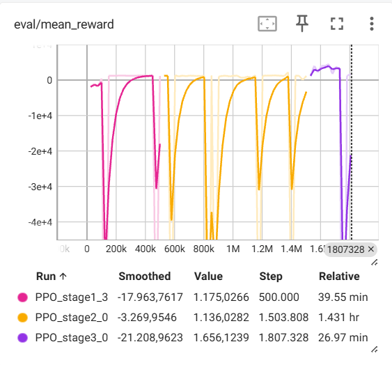
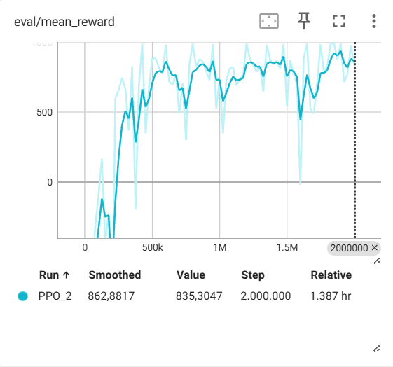

# TESTING.md — Test ve Doğrulama

Sistemin test senaryoları, sınırları ve sonuçları.

---

## Test Ortamları

### 1. Rastgele parkur (eğitim ortamı)

`visualize_pygame.py` ve `evaluate.py` — her episode rastgele başlangıç/hedef, rastgele engel sayısı (5–9).

**Kullanım:**
```bash
python visualize_pygame.py --model models_hybrid_2/best/best_model --n_episodes 5 --fps 10
python evaluate.py --model models_hybrid_2/best/best_model --n_episodes 20
```

### 2. Zorlu sabit parkur (hard course)

`test_hard_course_pygame.py` ve `test_hard_course.py` — `hard_course_config.py` içindeki sabit engel yerleşimi.

**Kullanım:**
```bash
# Swap mod: start=sağ üst, hedef=sol alt
python test_hard_course_pygame.py --model models_hybrid_2/best/best_model --n_episodes 5

# Normal mod: start=sol alt, hedef=sağ üst
python test_hard_course_pygame.py --model models_hybrid_2/best/best_model --no_swap
```

---

## Aşamalı (Stage'li) Eğitim Deneyleri

Ana model şu anda tek modda, tam rastgele başlangıç/hedef ve rastgele engel sayısı ile eğitilmektedir. Bunun yanında, eğitim sürecinde **aşamalı (curriculum) bir PPO mimarisi** de denenmiş ve sonuçlar gözlemlenmiştir.

### Stage yapısı ve amaç

- Toplam **5 stage** tanımlandı (`TOTAL_STAGES = 5`).
- **Stage 1:** Öncelikle birlikte uçmayı ve ortak hedefe gitmeyi öğretmek için daha basit, az engelli senaryolar.
- **Stage 2–5:** Engel sayısı, mesafe ve hedef konfigürasyonları kademeli olarak zorlaştırıldı; her stage’de ortam biraz daha karmaşık hale getirildi.
- Her stage, kendi ortam yapılandırmasına sahip ayrı bir `MultiDroneEnv(stage=stage)` ile temsil edildi.

Her stage için:

- Belirli bir **başarı oranı eşiği** tanımlandı (örneğin `%92`, `%85`, `%80`, ...).
- PPO modeli, o stage’de bu eşiğe ulaşana kadar eğitildi.
- Eşiğe ulaşıldığında model, ilgili stage için kaydedildi ve bir sonraki stage’e bu modelden devam edildi.

Bu süreç, örnek bir stage eğitim script’i ile gerçekleştirildi:

- `SubprocVecEnv` ile 8 paralel ortam (`N_ENVS = 8`),
- Her `EVAL_FREQ` adımda başarı oranını ölçen bir `StageCallback`,
- `evaluate_success_rate()` fonksiyonu ile her stage için ayrı headless değerlendirme,
- `train_stage(stage, ...)` içinde, başarı eşiği sağlanana veya adım limiti dolana kadar yinelemeli `model.learn(...)`.

### TensorBoard gözlemleri

Stage’li eğitimde TensorBoard’daki `eval/mean_reward` grafiği şu davranışı gösterdi:

- Her stage’in başlangıcında reward kısa süreli olarak düşük seviyede başlıyor, birkaç yüz bin adımda hızla yükselip hedeflenen başarı eşiğine yaklaşıyor.
- Yeni bir stage’e geçildiğinde, ortam aniden zorlaştığı için modelin ilk değerlendirmelerinde reward **sert şekilde düşüyor** (grafikte büyük negatif spike’lar).
- Eğitime devam edildikçe model yeni stage’e de uyum sağlıyor ve reward tekrar yükseliyor.

Örneğin, aşağıdaki koşulda üç stage için `eval/mean_reward` eğrileri gözlendi:

- `PPO_stage1_3` (pembe) — Stage 1
- `PPO_stage2_0` (turuncu) — Stage 2
- `PPO_stage3_0` (mor) — Stage 3

Bu grafikte her stage’in başında reward’ın sıfırın çok altına düştüğü, ardından yeniden toparlandığı açıkça görülmektedir.

Örnek bir koşunun TensorBoard çıktısı aşağıdaki şekilde kaydedilmiştir:



Karşılaştırma için, nihai tek-mod rastgele eğitim koşusunun `eval/mean_reward` grafiği de aşağıda verilmiştir:



### Sonuç ve tercih edilen yaklaşım

- Aşamalı eğitim, her stage için tanımlanan başarı oranlarına ulaşabilmiştir; ancak stage geçişlerinde ciddi kararsızlıklar ve kısa süreli “unlearning” etkisi oluşmuştur.
- Uzun süreli koşularda (yüksek toplam timestep değerlerinde) bazı stage koşularında performansın tekrar bozulduğu ve eğrinin istikrarsızlaştığı gözlenmiştir; yani curriculum, her zaman kalıcı bir iyileşme garantilememektedir.
- Nihai çözümde, **genelleme** ve **sadeliği** önceliklendirmek için tek modlu “tam rastgele” eğitim yaklaşımı tercih edilmiştir.
- Stage’li PPO ise, daha büyük haritalar, daha uzun rotalar veya daha karmaşık görevler için ileride tekrar değerlendirilebilecek bir alternatif strateji olarak not edilmiştir.

---

## Engel Konfigürasyonları

### Sabit engel sayısı

`--n_obstacles N` ile test:

```bash
python evaluate.py --model models_hybrid_2/best/best_model --n_obstacles 3 --n_episodes 20
python evaluate.py --model models_hybrid_2/best/best_model --n_obstacles 7 --n_episodes 20
```

| Engel sayısı | Beklenen | Not |
|--------------|----------|-----|
| 2–3         | Yüksek başarı | Eğitimden daha az engel |
| 5–9         | Orta–yüksek   | Eğitim aralığında |
| 10+         | Düşük         | Eğitimde görülmemiş |

### Zorlu parkur (hard_course_config.py)

9 sabit engel, belirli pozisyonlarda. Dar geçitler ve köşe manevraları içerir.

---

## Wall Sliding Açık/Kapalı Karşılaştırması

### Wall sliding açık (varsayılan)

- Duvar/duvara temas edildiğinde hız duvar yönünde sıfırlanır, diğer yönde hareket devam eder.
- Köşelerde kayarak dönüş mümkün.

**Test:**
```bash
python train.py --timesteps 500000   # wall_sliding=True (varsayılan)
python evaluate.py --model ...       # ortam wall_sliding=True
```

### Wall sliding kapalı

- Pozisyon `clip(3, 47)` ile sınırlanır; duvara çarpınca duvarda kalır.

**Test:**
```bash
python train.py --timesteps 500000 --no_wall_sliding
# evaluate.py wall_sliding parametresini desteklemiyorsa, env.py'de değişiklik gerekir
```

**Gözlem:** Wall sliding kapalıyken duvara yapışma daha sık; özellikle köşelerde takılma artar. Açık mod daha akıcı navigasyon sağlar.

---

## Test Senaryoları Özeti

| Senaryo              | Script                     | Engel     | Start/hedef |
|----------------------|----------------------------|-----------|-------------|
| Rastgele, headless   | `evaluate.py`              | 5 (veya N)| Rastgele    |
| Rastgele, görsel     | `visualize_pygame.py`      | 5–9       | Rastgele    |
| Hard course, swap    | `test_hard_course_pygame.py` | 9 sabit | Sağ üst → sol alt |
| Hard course, normal  | `test_hard_course_pygame.py --no_swap` | 9 sabit | Sol alt → sağ üst |

---

## Sistem Sınırları

- **Engel yoğunluğu:** 10+ engelde performans belirgin düşer (eğitimde 5–9 kullanıldı).
- **Grid boyutu:** 50×50 sabit; farklı boyutlar için yeniden eğitim gerekir.
- **Drone sayısı:** 4 sabit; farklı sürü boyutu için ortam ve model değişikliği gerekir.
- **VecNormalize:** Model yüklenirken `vec_normalize.pkl` kullanılmalı; aksi halde observation ölçeği uyumsuz olur.
